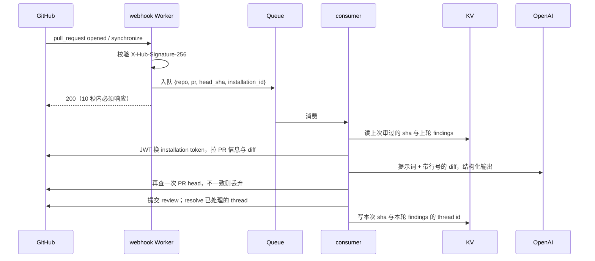

# CodeSeer 设计

自建 GitHub PR 审查机器人的方案与已定决策。本文只记慢变的结构性决定和它们的理由；模型型号、阈值数字这类会变的东西记在代码和配置里，这里只说选择的判据。

## 1. 动机

- 现有收费审查工具（CodeRabbit 一类）对私有仓库有数量限制，或只给试用期，个人十几个仓库覆盖不全
- 每仓配置一份 workflow 太麻烦，要的是一处安装、全仓生效，新建仓库自动纳入

## 2. 已定决策（2026-09-05 至 2026-09-06）

| # | 决策 | 理由 |
|---|------|------|
| 1 | **GitHub App + Webhook 服务**，不用 GitHub Actions | Actions 要每仓放 workflow 文件，与动机二冲突；App 安装时选 All repositories，新仓自动覆盖 |
| 2 | **单租户**，只服务 HarlonWang 账号 | 动机是自用替代收费工具，不预留多安装者结构，代码简单 |
| 3 | **托管在 Cloudflare Workers 付费版**，webhook 入口与审查执行用 **Queues** 解耦 | 与 eventbase、loginbase 同栈；`waitUntil` 的后台时长扛不住几十秒到几分钟的模型调用，Queues consumer 有分钟级执行时间；付费版已有，零增量成本 |
| 4 | **状态存 KV**，按 `repo + pr` 一条记录 | 只需按主键读写，不需要查询；D1 是过度设计 |
| 5 | **模型用 OpenAI**，结构化输出（JSON schema）强制返回格式 | 型号动手时按当前列表按价格和能力定，不写死在文档 |
| 6 | **只喂 diff，不喂整文件** | 成本可控，多数问题在 diff 上下文内可见；允许模型对上下文不足的地方不发表意见，不硬猜 |
| 7 | **一次提交一个 review**，事件类型 `COMMENT` | 机器人不应有权卡合并，不用 `REQUEST_CHANGES` |
| 8 | **评论用中文**，全局一种 | 私有仓自己看；将来公开仓要英文，改提示词里的一个变量即可 |
| 9 | 名字 **CodeSeer**，slug `codeseer` | 见第 10 节 |

## 3. 第一版范围

做：

1. PR 打开时审一次：一段 summary（改了什么、风险点）加若干 inline 评论，精确到文件和行
2. push 新 commit 后增量审：只看新增 diff，不重复刷已提过的意见
3. 已处理判定：上一轮意见被修掉的自动 resolve，summary 开头汇报上轮 N 条、已处理 M 条、待处理 K 条
4. 全局忽略规则：lock 文件、生成代码、二进制、vendored 代码不审；单文件 diff 超阈值跳过并在 summary 里说明

不做（第一版）：

- 评论里 @ 机器人追问或让它重审
- 仓库级配置文件（忽略路径、语言、严格程度按仓定制）
- 多租户、对外安装
- 审查结果的统计面板

## 4. 链路



webhook Worker 和 consumer 放同一个 Worker 项目，靠 queue 绑定区分 `fetch` 和 `queue` 两个入口。

## 5. GitHub App 配置

| 项 | 值 |
|----|-----|
| 显示名 | CodeSeer |
| slug | codeseer |
| 安装范围 | HarlonWang 账号，All repositories |
| 订阅事件 | Pull request |
| 权限 Pull requests | Read & write（读 PR、提交 review、resolve thread） |
| 权限 Contents | Read（拉 diff 与 compare） |
| 权限 Metadata | Read（必选） |

权限按最小集申请，之后要加再改。

鉴权链：App 私钥签 JWT，用 JWT 换取该安装的 installation token（有效 1 小时），后续 REST 与 GraphQL 都用它。单租户下 installation id 固定，但仍从 webhook payload 里取，不写死。

Secrets 三样，全部走 `wrangler secret`：App 私钥、webhook secret、OpenAI key。

## 6. 状态存储

KV 一条记录，key 为 `owner/repo#pr`：

```
{
    last_reviewed_sha: string,
    findings: [{
        thread_id: string,   // GraphQL node id，resolve 用
        path: string,
        line: number,
        comment: string
    }]
}
```

`findings` 只保留机器人自己提的、且上一轮结束时仍未解决的意见。PR 关闭或合并后记录可以留着，KV 加过期时间即可。

## 7. 审查引擎

### 7.1 输入

- PR 标题和描述，让模型知道作者意图
- 逐文件 unified diff，**每行前面标上新文件的绝对行号**。GitHub Reviews API 支持 `line` + `side: RIGHT` 定位，模型直接回绝对行号即可，不用算老式 position 偏移
- 增量审时另附上一轮未解决且锚定行被本次改动的意见列表（见第 9 节）

### 7.2 输出

结构化输出，JSON schema 固定：

```
{
    summary: string,
    findings: [{ path, line, severity, comment }],
    resolved: [thread_id]      // 增量审时才有
}
```

### 7.3 落评论前的校验

每条 finding 的 `line` 必须落在该文件 diff 的新增或修改行里。GitHub 对无效行号返回 422 且整个 review 提交失败，所以校验不过的条目**降级并入 summary 文字**，不丢弃。

校验对照的是**整个 PR 相对 base 的 diff**，增量审也一样，因为评论是挂在 PR 上的。

### 7.4 提交

Reviews API 一次提交：`event: COMMENT`，body 为 summary，`comments` 为 inline 列表。提交后用 GraphQL 拿回各 thread 的 node id，写入 KV。

## 8. 增量审

- `synchronize` 事件触发时，从 KV 取 `last_reviewed_sha`，用 Compare API 取 `last_reviewed_sha...head_sha` 的差异，只把这部分喂模型
- 力推（force push）后旧 sha 不在历史里，Compare 失败，退化为整 PR 重审
- KV 里没有记录（App 安装前就开着的 PR）也按整 PR 重审

### 去重

连续快速 push 会入队多条任务。consumer 在落评论前再查一次 PR 当前 head，与任务里的 `head_sha` 不一致就直接丢弃，只让最新一次落地。模型调用的费用已经花了，但评论不会重复。

## 9. 已处理判定

push 触发时：

1. 用 GraphQL 拉上一轮各 thread 的当前状态，`isResolved` 为真的（用户手动处理过）直接从 KV 记录里移除
2. 剩下的未解决意见分两组：
    - **锚定行在本次 diff 里被改动过的**：连同意见文本一起喂模型，让它逐条判定已处理 / 未处理。判定为已处理的，用 `resolveReviewThread` 标记
    - **锚定行没被碰过的**：默认未处理，不交给模型。这道机械门槛是有意的：模型单看 diff 容易把"顺手改了旁边一行"误判成"问题修了"，宁可漏标不要误标
3. summary 开头固定一段汇报：上轮 N 条，已处理 M 条，待处理 K 条并列出

thread 被机器人 resolve 后用户又 reopen 的，下一轮不再动它：状态拉取时它已是 reopen，锚定行大概率也没再变。避免机器人和人反复拉锯。

## 10. 命名

CodeSeer：code + seer（看的人、先知），与 CodeRabbit 同构。读作 code-seer，显示名用驼峰避免被切成 codes-eer。选定前查过 `github.com/apps/codeseer` 未被注册（2026-09-06）。

被否的方向：动物意象（Kestrel、Owlreview）、审阅工具意象（Loupe、Redline、Marginalia）、PR 双关（Prudent、Appraise）。用户偏好带 code 或 review 的合成词。

## 11. 故障与可观测

- 静默失败是 App 形态相比 Actions 的主要代价：Worker 挂了或模型超时，PR 上就没评论。第一版至少在 consumer 里把失败写进 Workers Logs，Queues 配 dead letter queue 兜底
- Queues 的重试对模型调用要谨慎：一次任务失败重试会再花一次模型费用，重试次数限制在个位数

## 12. 费用

按 diff 喂、用中档模型，一次中等 PR 审查约几美分，个人十几个仓库月度通常几美元以内。Workers 付费版已有，Queues 不额外收费。

## 13. 本地开发

- webhook 用 smee.io 一类工具转发到本机 `wrangler dev`
- 先用一个测试仓库单独安装 App 验证全链路，再改成 All repositories

## 14. 待定

- 模型型号：动手时查 OpenAI 当前列表，按价格与结构化输出支持定
- 单文件 diff 跳过阈值、单次审查总 token 上限：先拍一个数放配置里，跑几个真实 PR 后调
- 大 PR 是否拆成多次模型调用：第一版先不拆，超上限的文件跳过并说明
